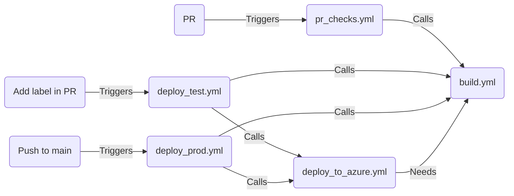

# SimpleWebApp
A very basic Node.js app to use as an example for workflows using GitHub Actions.

## Workflow status

## Workflows

The Node app can be deployed to Azure App Service with the included workflows, which are based on the default Actions. There are workflows that are triggered on the following events:
- Creating a PR.
- Adding a label during a PR.
- Merging into main.

There are two reusable workflows:
- build.yml which performs an npm install, build and test,
- deploy_to_azure.yml which deploys the web app to Azure App Service.

These are called by three calling workflows:

(This is an embedded [Markdown defined Mermaid diagram](https://github.blog/2022-02-14-include-diagrams-markdown-files-mermaid/))

Here's a change

