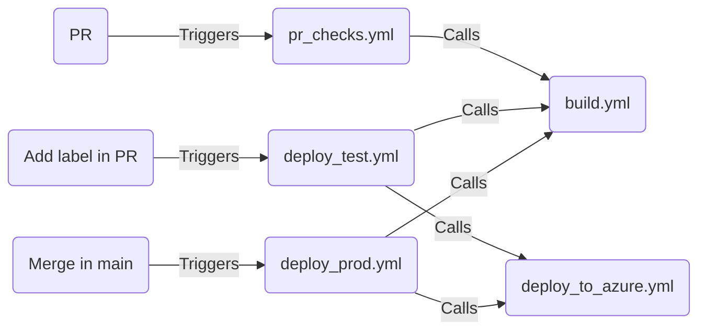

# SimpleWebApp
A very basic Node.js app to use as an example for workflows using GitHub Actions.

## Workflow status

## Workflows

The Node app can be deployed to Azure App Service with the included workflows, which are based on the default Actions. There are workflows that are triggered on the following events:
- PR
- Adding a label during a PR
- Merging into main

There is also a simple resuable workflow, build.yml, which is called from the other workflows to show how to avoid duplication and keep maintenance simpler:

(This is an embedded [Markdown defined Mermaid diagram](https://github.blog/2022-02-14-include-diagrams-markdown-files-mermaid/))
